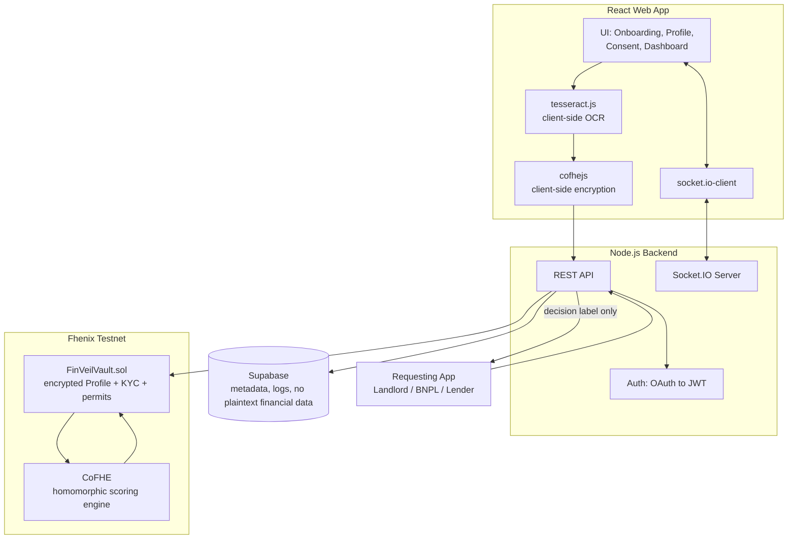
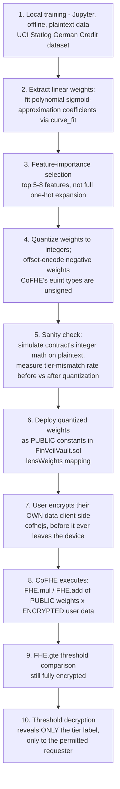
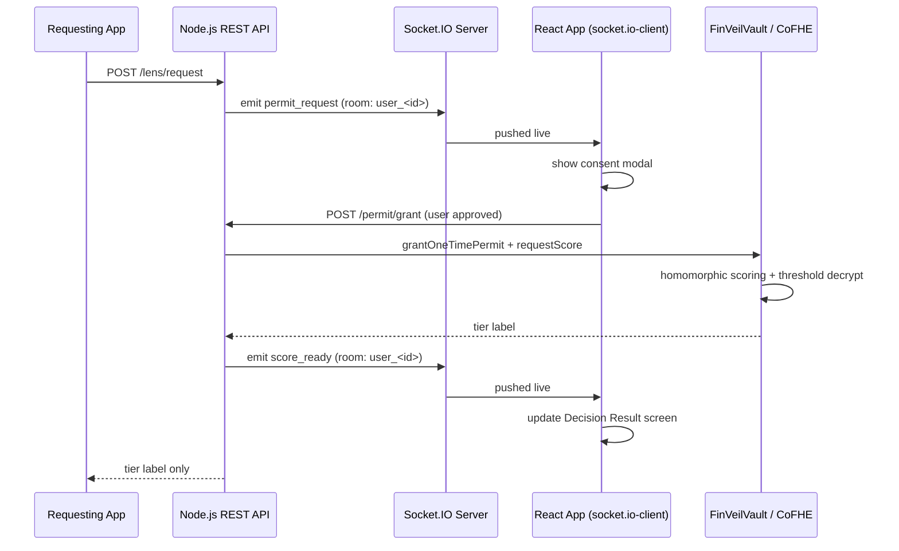

# FinVeil — Your Encrypted Financial Passport

A personal, portable, encrypted financial identity. Users build one encrypted profile once; third parties (landlords, BNPL providers, lenders) get a decision — never the underlying numbers.

Built for the **Fhenix hackathon**, using **CoFHE** (Fully Homomorphic Encryption) to compute financial decisions directly on ciphertext.

---

## Table of Contents

1. [Overview](#1-overview)
2. [Problem & Solution](#2-problem--solution)
3. [Tech Stack](#3-tech-stack)
4. [System Architecture](#4-system-architecture)
5. [Model Training → Weight Deployment → Encrypted Execution](#5-model-training--weight-deployment--encrypted-execution)
6. [CoFHE Mathematics](#6-cofhe-mathematics)
7. [Real-Time Layer (Socket Flow)](#7-real-time-layer-socket-flow)
8. [Security & Privacy Principles](#8-security--privacy-principles)
9. [Architecture Decision Records](#9-architecture-decision-records-adrs)
10. [Project Structure](#10-project-structure)
11. [Getting Started](#11-getting-started)
12. [Roadmap](#12-roadmap)

---

## 1. Overview

Every fintech, rental platform, and lender today either **over-collects data** (full bank statements, complete transaction history, permanent plaintext copies on someone else's server) or **excludes people with no traditional data** (gig workers, students, new-to-country users).

FinVeil solves both: a user encrypts their financial profile once, on their own device. Every time a third party needs to know something — "is this person rental-ready," "can they afford this BNPL limit," "what's their credit tier" — a small scoring model runs **directly on the ciphertext**, and only the final decision is ever revealed, to that one requester, for that one request, with an expiry.

---

## 2. Problem & Solution

| | |
|---|---|
| **Problem** | Financial scoring requires computation over sensitive data. Normal encryption (TLS, at-rest encryption) protects data in transit and storage, but the scoring model still has to decrypt before it can compute — so someone always sees the plaintext at the moment of computation. |
| **Solution** | Fully Homomorphic Encryption lets the scoring computation itself happen on ciphertext. `Enc(a) + Enc(b)` decrypts to exactly `a + b` — the math works without anyone ever reconstructing `a` or `b`. Only the final decision is threshold-decrypted, and only to a requester holding a scoped, one-time, expiring permit. |

---

## 3. Tech Stack

| Layer | Technology |
|---|---|
| Frontend | React.js (web app) |
| Backend | Node.js |
| Database | Supabase (Postgres) |
| Authentication | OAuth + JWT |
| On-chain compute | Solidity + Fhenix CoFHE |
| Real-time layer | Socket.IO |
| Client-side OCR | tesseract.js (WASM) |
| Offline model training | Python — pandas, scikit-learn, SciPy |

---

## 4. System Architecture



**Key property:** the only data that ever reaches the backend or the chain is already encrypted (financial fields, KYC fields) or already a final decision (tier labels, pass/fail). Raw plaintext financial data exists only transiently, client-side, before encryption.

---

## 5. Model Training → Weight Deployment → Encrypted Execution

This is the full pipeline from offline machine learning to on-chain encrypted inference. It's important to be precise about what's actually encrypted at each stage: **the model weights are public, plaintext constants — they don't need protection. Only the user's input data does.**



| Stage | What's plaintext | What's encrypted |
|---|---|---|
| 1-5. Training, quantization, sanity check | Everything — real training data, weights, coefficients | Nothing yet |
| 6. Weight deployment | Weights (public contract constants) | N/A — weights are not secret |
| 7. User profile submission | Never — encrypted before it leaves the device | User's financial data (from that point on) |
| 8-9. Scoring | Nothing | User data, the weighted sum, the threshold comparison |
| 10. Decision reveal | The final tier label only, to the permitted requester | The underlying score and all input fields remain encrypted forever |

---

## 6. CoFHE Mathematics

### 6.1 Weighted scoring
```
z = FHE.add(
  FHE.mul(income, w1),
  FHE.add(FHE.mul(accountLiquidity, w2),
  FHE.add(FHE.mul(creditScore, w3),
          FHE.mul(debtRatio, w4)))
)
```
All four inputs are ciphertext; `w1..w4` are public quantized integer weights, deployed alongside the contract.

### 6.2 Polynomial activation — sign-preserving

FHE natively supports `+`, `×`, and comparisons — not `sigmoid` or `ReLU`. A naive stand-in like `z² ` is a documented mistake to avoid: since `(-z)² = z²`, it destroys the sign of `z`, i.e. the direction of the decision. The correct approach, used in published encrypted-inference systems, is a **least-squares polynomial fit to the sigmoid curve**, which keeps a linear term:

```
activation(z) ≈ c0 + c1·z + c2·z²
```

`c0, c1, c2` are fit offline (`scipy.optimize.curve_fit`) against the real sigmoid function, over the actual range of `z` the trained model produces — not an arbitrary guess.

### 6.3 Multi-layer network

```
z1 = weighted_sum(inputs, weights_layer1)
a1 = c0 + c1·z1 + c2·z1²
z2 = a1 · w5 + bias1
a2 = d0 + d1·z2 + d2·z2²
final_score = a2 · w6 + bias2
```

A genuine shallow network — linear → nonlinear → linear → nonlinear → linear — evaluated entirely on ciphertext.

### 6.4 Quantization & offset encoding

FHE arithmetic works over integers. Weights are scaled (e.g. `SCALE = 100`) and rounded to integers before deployment. Since **CoFHE's `euint` types are unsigned**, negative weights (common in trained models) require offset encoding:

```
quantized_signed = round(weight * SCALE)
quantized_unsigned = quantized_signed + OFFSET   # OFFSET large enough to keep everything ≥ 0
```

The accumulated offset (`num_features × OFFSET`) is subtracted back out after the FHE sum, before the threshold comparison — keeping every intermediate ciphertext non-negative throughout, as unsigned encrypted arithmetic requires.

### 6.5 Threshold decryption

```
isTierA = FHE.gte(final_score, thresholdA)
isTierB = FHE.gte(final_score, thresholdB)
result  = FHE.select(isTierA, "Tier A", FHE.select(isTierB, "Tier B", "Declined"))
```

`result` is the only value ever threshold-decrypted, and only to the specific address holding a valid, unexpired, scoped permit for that specific request.

---

## 7. Real-Time Layer (Socket Flow)

REST alone can't push a live consent prompt to a user's screen the moment a third party requests a score. Real-time delivery uses `socket.io`, authenticated with the same JWT used for REST, with each user placed in a private room keyed to their own `user_id`.



| Event | Direction | Purpose |
|---|---|---|
| `connect` (handshake) | Client → Server | Authenticates the socket with the existing JWT, joins `user_<id>` room |
| `permit_request` | Server → Client | Live consent prompt for a lens or KYC verification request |
| `permit_response` | Client → Server | User's approve/deny decision |
| `score_ready` | Server → Client | Decision revealed the moment threshold decryption completes |
| `verification_result` | Server → Client | KYC pass/fail delivered live |
| `permit_expired` | Server → Client | Live-updates the access log without a manual refresh |

If the socket disconnects, the same data remains reachable via REST polling (`/permit/status`, `/dashboard/me`) — sockets make it feel instant, they aren't a single point of failure.

---

## 8. Security & Privacy Principles

- **Encrypt before it leaves the device.** Financial data, KYC data, and OCR-derived values are encrypted client-side (`cofhejs`) before any network call.
- **Compute without decrypting.** All scoring math runs on ciphertext via CoFHE; nothing is ever reconstructed to plaintext during computation.
- **Reveal only the decision.** Threshold decryption exposes a single label — never the underlying score or input fields.
- **Every access is scoped and expiring.** Permits are one-time, tied to a specific requester and a specific lens or check, with an explicit expiry — not standing integrations.
- **OCR never touches a server.** Bank statement parsing runs entirely in-browser (`tesseract.js`); only the final computed liquidity number is ever encrypted and submitted.
- **KYC is verify-once, reuse-everywhere.** A leaked verification token proves "verified at time X" and nothing more — it carries no name, ID, or address.

---

## 9. Architecture Decision Records (ADRs)

### ADR-001: Web app (React) instead of a native mobile app
- **Status:** Accepted
- **Context:** Initial plan targeted Flutter for a mobile app. Client-side FHE encryption (`cofhejs`) is a JavaScript/WASM library.
- **Decision:** Build as a React web app instead of a native mobile app.
- **Consequences:** `cofhejs` runs natively in-browser with no platform bridge or native FFI required, simplifying the client significantly. Trade-off: no offline-first mobile experience for this build.

### ADR-002: Linear scorecard + fitted polynomial activation, not logistic regression or a full neural net
- **Status:** Accepted
- **Context:** FHE natively supports `+`, `×`, and comparisons — not `sigmoid`, `ReLU`, or other nonlinear activations.
- **Decision:** Use a weighted linear combination as the base computation, with a least-squares polynomial approximation of sigmoid as the activation function where nonlinearity is needed.
- **Consequences:** Keeps every operation FHE-native and auditable. Sacrifices some modeling capacity compared to an unconstrained neural network, in exchange for feasibility under encryption. This is the same constraint published encrypted-inference systems (CryptoNets, Concrete ML) operate under.

### ADR-003: Offset encoding for negative weights
- **Status:** Accepted
- **Context:** Trained model weights are frequently negative; Fhenix's `euint` types are unsigned.
- **Decision:** Encode all weights with a fixed positive offset before deployment; subtract the accumulated offset back out after the homomorphic sum, before threshold comparison.
- **Consequences:** Every intermediate ciphertext stays non-negative, avoiding unsigned-underflow behavior. Requires careful offset sizing to avoid overflow at the upper bound instead.

### ADR-004: Client-side OCR (tesseract.js), not backend OCR
- **Status:** Accepted
- **Context:** Deriving an account-liquidity signal from a bank statement requires parsing the raw document, which FHE cannot do — it can only compute on already-encrypted numbers.
- **Decision:** Run OCR entirely in-browser via `tesseract.js` (WASM); only the final computed liquidity score is encrypted and submitted.
- **Consequences:** Preserves the "raw data never leaves the device" guarantee. Trade-off: parsing accuracy is dependent on statement format and must be tested against controlled sample formats rather than arbitrary real-world statements within the build timeline.

### ADR-005: Real-time updates via Socket.IO with per-user authenticated rooms
- **Status:** Accepted
- **Context:** Consent prompts and decision results must reach the user's screen the moment a third party makes a request — REST request/response cannot push unprompted.
- **Decision:** Use `socket.io`, authenticated at handshake with the existing JWT, with each connection joined to a private room keyed to its own `user_id`.
- **Consequences:** Enables live consent/decision delivery without polling. Requires a REST-based fallback path so a dropped socket connection doesn't block core functionality.

### ADR-006: Credit bureau score sourced via the same scoped-permit pattern as KYC
- **Status:** Accepted
- **Context:** Both KYC verification and credit-bureau score retrieval are "verify once, prove selectively" problems with the same trust shape.
- **Decision:** Reuse the KYC one-time-permit and threshold-decryption pattern for credit bureau score retrieval, rather than building a separate integration.
- **Consequences:** Reduces implementation surface area; keeps the trust model consistent across the product. For the hackathon build, the "bureau" is a seeded synthetic value behind this same pattern.

### ADR-007: Replace categorical dataset proxies with real numeric signals
- **Status:** Accepted
- **Context:** The UCI German Credit dataset's "checking account status" and "credit history" fields are coarse, self-reported, static categories — weaker than what a real product should measure.
- **Decision:** Design the `Profile` schema around the real signal each category was standing in for — an account-statement-derived liquidity score, and a real credit bureau score — rather than encoding the dataset's categorical buckets directly.
- **Consequences:** The schema reflects what FinVeil would actually collect in production. For the hackathon, both real data sources are mocked with synthetic equivalents behind the same interfaces described in ADR-004 and ADR-006.

### ADR-008: One-time, scoped, auto-expiring permits instead of standing integrations
- **Status:** Accepted
- **Context:** Most financial data-sharing today is a standing integration (a linked account stays linked indefinitely).
- **Decision:** Every third-party access to a lens or verification check requires an explicit, single-use, time-bound permit granted at request time.
- **Consequences:** Every disclosure is visible, deliberate, and revocable — the core trust differentiator of the product. Requires a live approval step (Section 7) rather than a one-time setup, which is the intended trade-off.

---

## 10. Project Structure

```
finveil/
├── contracts/
│   ├── FinVeilVault.sol
│   └── test/
├── backend/
│   ├── src/
│   │   ├── auth/
│   │   ├── routes/
│   │   ├── sockets/
│   │   └── db/
│   └── package.json
├── frontend/
│   ├── src/
│   │   ├── pages/
│   │   ├── components/
│   │   ├── encryption/       # cofhejs integration
│   │   ├── ocr/               # tesseract.js integration
│   │   └── sockets/
│   └── package.json
└── model-training/
    ├── train_scorecard.ipynb
    └── lens_weights.json      # quantized weights, deployed to contracts/
```

---

## 11. Getting Started

> Setup instructions will be finalized alongside implementation. Scaffold below reflects the planned structure.

```bash
# Contracts
cd contracts && npm install && npx hardhat compile

# Backend
cd backend && npm install && npm run dev

# Frontend
cd frontend && npm install && npm run dev

# Model training
cd model-training && pip install pandas numpy scikit-learn scipy ucimlrepo
jupyter notebook train_scorecard.ipynb
```

Environment variables (backend): `SUPABASE_URL`, `SUPABASE_KEY`, `JWT_SECRET`, `OAUTH_CLIENT_ID`, `OAUTH_CLIENT_SECRET`, `FHENIX_RPC_URL`, `VAULT_CONTRACT_ADDRESS`.

---

## 12. Roadmap

- Real Open Banking / Account Aggregator integration, replacing the mocked account-statement input
- Real credit bureau API integration, replacing the seeded synthetic score
- Aggregate, opted-in analytics dashboard (e.g. rental-readiness benchmarks by city)
- Additional lenses beyond the initial four (Rental-Readiness, BNPL, Credit Tier, Budgeting-Health)
